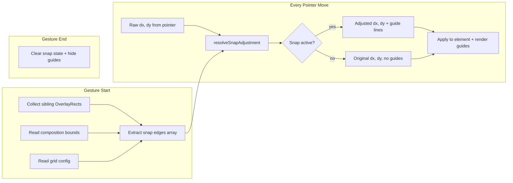

# Preview Canvas Snap Lines, Alignment Guides & Grid Overlay

## Summary

Add Figma-quality snapping to the Studio preview canvas. When dragging or resizing elements, alignment guides appear showing edge-to-edge, center-to-center, and composition boundary alignment. Equidistance guides show equal spacing between elements. A toggleable grid overlay with snap-to-grid rounds out the system. The snap engine operates entirely in overlay coordinate space, keeping the existing gesture pipeline untouched except for a thin snap-adjustment hook.

---

## Problem Frame

Studio's preview canvas currently supports drag, resize, and rotate gestures but offers no alignment assistance. Users must eyeball element positioning, making it impossible to precisely align elements to each other, to the composition center, or to a grid. Every professional NLE and design tool (Figma, After Effects, Motion, Premiere Pro) provides snap/alignment guides - their absence is a gap that makes Studio feel amateur for precision work.

---

## Requirements

- **R1.** During drag gestures, snap the dragged element's edges and center to the edges and center of all other visible elements on the canvas, the composition edges, and the composition center lines.
- **R2.** During resize gestures, snap the resizing edge to the same targets as R1.
- **R3.** Render vertical and horizontal snap guide lines across the full overlay when a snap is active. Lines appear only during the gesture and disappear on pointer-up.
- **R4.** Show equidistance guides (Figma-style spacing indicators) when the dragged element's gap to one neighbor equals its gap to another neighbor on the same axis.
- **R5.** Provide a toggleable grid overlay with configurable spacing. When snap-to-grid is enabled, element positions snap to grid intersections during drag/resize.
- **R6.** Snapping is always-on by default. Holding a modifier key (Alt/Option) temporarily disables snapping during a gesture.
- **R7.** Snap tolerance is defined in overlay-space pixels (default 6px) so it feels consistent regardless of zoom level.
- **R8.** The snap engine must perform well with up to 80 elements on the canvas (the existing `maxItems` cap in `collectDomEditLayerItems`).
- **R9.** Snap and grid preferences (enabled, grid spacing, grid visible, snap-to-grid) persist via `studioUiPreferences` (localStorage).
- **R10.** Group drag snapping: when multiple elements are selected and dragged together, snap the group's bounding box edges/center, not individual members.

---

## Key Technical Decisions

### KTD1. Snap computation in overlay coordinate space

All snap math operates on `OverlayRect` values - the already-computed screen-space rectangles used by `DomEditOverlay`. This avoids duplicating the complex iframe-to-overlay coordinate transformation. The snap engine receives the dragged element's current overlay rect and an array of target overlay rects, and returns adjusted dx/dy deltas plus active snap line positions.

**Rationale:** The overlay rects are already computed every RAF frame by `useDomEditOverlayRects`. They account for composition scaling, nested sub-compositions, and GSAP transforms. Working in this space means snap calculations are a simple 1D comparison on each axis.

### KTD2. Snap as a pure function injected into the gesture pipeline

The snap engine is a stateless pure function: `resolveSnapAdjustment(input) → { dx, dy, guides[] }`. It's called inside the existing `onPointerMove` handler in `useDomEditOverlayGestures.ts` after computing raw dx/dy but before applying them. No new hooks, no new state management - just a function call that adjusts the deltas.

**Rationale:** The gesture system uses refs and imperative DOM updates for performance (no React re-renders during drag). A pure function fits this pattern perfectly. It's also trivially testable.

### KTD3. Snap targets collected once at gesture start, not every frame

When a drag or resize gesture begins, collect all sibling element overlay rects into a flat array of snap edges. This array is stored on the `GestureState` and reused for every pointer-move event during the gesture. Elements don't move relative to each other during a single-element drag, so the snapshot is valid for the gesture's lifetime.

**Rationale:** Avoids querying the iframe DOM or recalculating overlay rects for non-dragged elements on every pointer-move. With 80 elements, this is the difference between O(1) per-frame work and O(n) DOM reads per frame.

### KTD4. Snap guide rendering via a dedicated React component with ref-driven updates

A `<SnapGuideOverlay>` component renders inside the `DomEditOverlay` div. During gestures, snap guide positions are written to a ref and flushed to DOM via direct style manipulation (same pattern as `boxRef` in the existing gesture code), bypassing React re-renders. On gesture end, the ref is cleared and the guides disappear.

**Rationale:** React state updates during drag cause frame drops. The existing codebase already uses this ref-driven pattern for the selection box - snap guides follow the same approach.

### KTD5. Grid overlay as a CSS background pattern

The grid overlay uses a CSS `background-image` with `repeating-linear-gradient` on the overlay div, not canvas or SVG. Grid lines are purely visual - snap-to-grid is computed in the snap engine using modular arithmetic, not by iterating grid lines.

**Rationale:** CSS gradients are GPU-composited and zero-JS-cost. They scale perfectly with the preview zoom because they're applied to the overlay which already matches the composition's visual size. No canvas/SVG management needed.

### KTD6. Equidistance detection via sorted-edge scan

To find equal spacing, sort all element rects by position on each axis, then scan adjacent pairs to find gaps. When the gap between the dragged element and neighbor A equals the gap between neighbor A and neighbor B, show a spacing indicator. This is O(n log n) per axis at gesture start (sorting) and O(n) per pointer-move (scanning the sorted list).

**Rationale:** Figma's equidistance guides are the feature's signature UX differentiator. The sorted-edge approach is the standard algorithm - simple, fast, and well-understood.

---

## High-Level Technical Design

### Snap Engine Data Flow



### Snap Edge Model

Each snap target produces up to 5 edges per axis:

```
Horizontal edges (for vertical snap lines):  left, centerX, right
Vertical edges (for horizontal snap lines):  top, centerY, bottom
```

The snap engine tests the dragged element's 3 edges against all target edges on each axis. The closest match within threshold wins. When multiple edges match at the same distance, all are shown as guides (Figma behavior).

### Component Architecture

```
DomEditOverlay (existing)
├── Selection box (existing)
├── Resize handle (existing)
├── Rotation handle (existing)
├── SnapGuideOverlay (new)         ← renders guide lines + spacing indicators
└── GridOverlay (new)              ← CSS background grid, always rendered when enabled
```

---

## Scope Boundaries

### In scope
- Element-to-element snap (edges + centers) during drag and resize
- Composition boundary snap (edges + center lines)
- Grid overlay with configurable spacing
- Snap-to-grid during drag and resize
- Equidistance/spacing guides with pixel labels
- Alt/Option hold-to-disable modifier
- Preferences persistence in localStorage
- Group drag snapping (bounding box)

### Deferred to Follow-Up Work
- User-placed ruler guides (drag-from-ruler paradigm)
- Safe area overlays (title-safe, action-safe)
- Rule-of-thirds overlay
- Snap during rotate gestures
- Snap sound/haptic feedback
- Keyboard arrow-key nudge with snap
- Infinite edge extension (After Effects toggle)

### Outside this feature's scope
- Timeline snapping (separate feature, different coordinate space)
- Undo/redo integration (snap doesn't create new state - it adjusts existing gestures)

---

## Implementation Units

### U1. Snap engine core - `snapEngine.ts`

**Goal:** Pure-function snap computation module with zero dependencies on React or DOM.

**Requirements:** R1, R2, R7

**Dependencies:** None

**Files:**
- `packages/studio/src/components/editor/snapEngine.ts` (new)
- `packages/studio/src/components/editor/snapEngine.test.ts` (new)

**Approach:**

Define types:
- `SnapEdge`: `{ position: number; source: 'element' | 'composition' | 'grid'; id: string }`
- `SnapTarget`: `{ left, top, right, bottom, centerX, centerY, id }`
- `SnapResult`: `{ dx: number; dy: number; guides: SnapGuide[]; spacingGuides: SpacingGuide[] }`
- `SnapGuide`: `{ axis: 'x' | 'y'; position: number; from: number; to: number }`
- `SpacingGuide`: `{ axis: 'x' | 'y'; position: number; size: number; from: number; to: number }`

Functions:
- `extractSnapTargets(rects: OverlayRect[], ids: string[]): SnapTarget[]` - converts overlay rects to snap targets
- `buildCompositionSnapTarget(compositionRect: OverlayRect): SnapTarget` - composition edges + center
- `buildGridSnapEdges(compositionRect: OverlayRect, gridSpacing: number): { x: SnapEdge[]; y: SnapEdge[] }` - grid line positions
- `resolveSnapAdjustment(input: { movingRect: OverlayRect; proposedDx: number; proposedDy: number; targets: SnapTarget[]; gridEdges?: { x: SnapEdge[]; y: SnapEdge[] }; threshold: number; disabled: boolean }): SnapResult` - the main entry point. Tests proposed position against all targets, returns adjusted deltas and guide positions.
- `resolveResizeSnapAdjustment(input: { movingRect: OverlayRect; resizeEdge: 'right' | 'bottom'; proposedDx: number; proposedDy: number; targets: SnapTarget[]; gridEdges?: ...; threshold: number; disabled: boolean }): SnapResult` - resize variant that only snaps the active resize edge.
- `resolveEquidistanceGuides(input: { movingRect: OverlayRect; targets: SnapTarget[]; threshold: number }): SpacingGuide[]` - scans for equal gaps between sorted elements.

The threshold operates in overlay pixels. At any zoom level, the overlay rect is already scaled, so a 6px threshold feels consistent.

**Patterns to follow:** Pure function style like `resolveDomEditResizeGesture` and `resolveDomEditRotationGesture` in `domEditOverlayGestures.ts`. Same input-object pattern, same deterministic output.

**Test scenarios:**
- Dragging element left edge within 6px of target right edge → dx adjusted to align, guide emitted at aligned position
- Dragging element center within threshold of composition center → snaps to center, two guide lines emitted (horizontal + vertical center)
- Dragging element with no targets within threshold → returns original dx/dy, empty guides
- Dragging element that matches multiple targets at same distance → all matching guides emitted
- Resize right edge within threshold of target left edge → dx adjusted, guide emitted
- Resize does not snap the non-resizing edges (top/left stay free during bottom-right resize)
- Grid snap: position within threshold of grid line → snaps to grid line
- Grid snap with element snap: element snap takes priority when both are within threshold
- Equidistance: three elements in a row, dragging middle element to equal gap → spacing guide emitted with correct pixel size
- Equidistance: no equal gaps → no spacing guides
- Threshold of 0 → no snapping occurs
- `disabled: true` → returns original dx/dy, empty guides
- Large number of targets (80) → correct results (no performance regression)

### U2. Snap target collection at gesture start

**Goal:** Collect all sibling element overlay rects into a snap target array when a drag or resize gesture begins. Store on `GestureState` / `GroupGestureState`.

**Requirements:** R1, R2, R8, R10

**Dependencies:** U1

**Files:**
- `packages/studio/src/components/editor/domEditOverlayGestures.ts` (modify - add `snapTargets` to state types)
- `packages/studio/src/components/editor/domEditOverlayStartGesture.ts` (modify - collect targets on start)
- `packages/studio/src/components/editor/snapTargetCollection.ts` (new - target collection logic)

**Approach:**

At gesture start in `startGesture()` and `startGroupDrag()`:
1. Read the iframe content document
2. Use `collectDomEditLayerItems()` (already exists, caps at 80) to get all editable elements
3. For each element that is NOT the dragged element (or not in the drag group), compute its `toOverlayRect()`
4. Convert to `SnapTarget[]` via `extractSnapTargets()`
5. Also build the composition snap target from the iframe/root rect
6. Store `{ snapTargets, compositionTarget }` on the gesture state

For group drag, exclude all group members from snap targets and use the group bounding box as the moving rect.

Read grid config from `studioUiPreferences` at gesture start. If snap-to-grid is enabled, pre-compute grid edges via `buildGridSnapEdges()` and store on gesture state.

**Patterns to follow:** The existing `startGesture` function in `domEditOverlayStartGesture.ts` already reads overlay rects and measures matrices. Target collection follows the same pattern - one-time setup cost at gesture start.

**Test scenarios:**
- Starting a drag with 5 sibling elements → 5 snap targets collected (dragged element excluded)
- Starting a drag with no siblings → only composition target present
- Starting a group drag with 3 selected, 2 unselected → 2 snap targets collected
- Elements in nested sub-compositions are included as targets (their overlay rects account for nesting)
- Hidden elements (display:none, opacity:0) are excluded via existing `isElementVisibleForOverlay` check

### U3. Snap adjustment in drag gesture handler

**Goal:** Inject snap adjustment into the pointer-move handler for single and group drag gestures.

**Requirements:** R1, R6, R7, R10

**Dependencies:** U1, U2

**Files:**
- `packages/studio/src/components/editor/useDomEditOverlayGestures.ts` (modify - call `resolveSnapAdjustment` in drag branch)

**Approach:**

In `onPointerMove`, inside the `g.kind === "drag"` branch:

1. Compute raw `dx`, `dy` from pointer delta (already done)
2. Build the proposed overlay rect: `{ left: g.originLeft + dx, top: g.originTop + dy, ... }`
3. Call `resolveSnapAdjustment({ movingRect: proposedRect, proposedDx: dx, proposedDy: dy, targets: g.snapTargets, gridEdges: g.gridEdges, threshold: SNAP_THRESHOLD_PX, disabled: e.altKey })`
4. Use the returned adjusted `dx`, `dy` instead of the raw values for all downstream operations (overlay rect update, box style, `applyManualOffsetDragDraft`)
5. Store the returned `guides` and `spacingGuides` on a ref for the `SnapGuideOverlay` to read

For group drag in the `groupG` branch, same pattern but using the group bounding box as the moving rect.

The Alt/Option key check (`e.altKey`) passes through as the `disabled` flag - when held, the snap engine returns raw deltas.

**Patterns to follow:** The existing rotation snap uses `e.shiftKey` to toggle 15-degree snapping - same modifier-key pattern.

**Test scenarios:**
- Dragging element near sibling edge → position snaps, guide lines appear
- Holding Alt while dragging → no snapping, free movement
- Releasing Alt mid-drag → snapping re-engages
- Dragging group near composition center → group bounding box snaps to center
- Dragging with snap disabled in preferences → no snapping occurs
- Pointer-up clears snap guides immediately

### U4. Snap adjustment in resize gesture handler

**Goal:** Inject snap adjustment into the pointer-move handler for resize gestures.

**Requirements:** R2, R6, R7

**Dependencies:** U1, U2

**Files:**
- `packages/studio/src/components/editor/useDomEditOverlayGestures.ts` (modify - call `resolveResizeSnapAdjustment` in resize branch)

**Approach:**

In `onPointerMove`, inside the `else` (resize) branch:

1. After computing raw dx/dy, build a proposed rect with the new width/height
2. Call `resolveResizeSnapAdjustment({ movingRect: proposedRect, resizeEdge: 'right' or 'bottom', proposedDx: dx, proposedDy: dy, targets: g.snapTargets, ... })`
3. Use the adjusted dx/dy for the resize calculation
4. Store guides on the ref for rendering

Only the actively resizing edges snap - the anchor edges (top-left) stay fixed.

**Patterns to follow:** Same injection point pattern as U3.

**Test scenarios:**
- Resizing right edge near sibling left edge → width snaps, vertical guide appears
- Resizing bottom edge near composition bottom → height snaps
- Uniform resize (Shift held) with snap → snaps the dominant axis, aspect ratio maintained
- Alt held during resize → no snapping

### U5. Snap guide overlay component - `SnapGuideOverlay.tsx`

**Goal:** Render snap guide lines and equidistance spacing indicators during active gestures.

**Requirements:** R3, R4

**Dependencies:** U1

**Files:**
- `packages/studio/src/components/editor/SnapGuideOverlay.tsx` (new)
- `packages/studio/src/components/editor/DomEditOverlay.tsx` (modify - add SnapGuideOverlay child)

**Approach:**

Component structure:
- Receives a ref (`snapGuidesRef`) that the gesture handler writes to on every pointer-move
- Runs its own RAF loop (or piggybacks on the existing overlay RAF) to read the ref and update DOM
- Renders guide lines as absolutely-positioned `<div>` elements: 1px wide/tall, full overlay extent, colored magenta/pink (#FF44CC at ~80% opacity - high contrast on both dark and light compositions, matches Figma convention)
- Renders equidistance indicators as small spans between elements showing the pixel distance, styled with a semi-transparent background pill

Guide line DOM: pre-allocate a pool of 6 divs (3 per axis max - left/center/right or top/center/bottom). Hide unused ones with `display: none`. Update positions via `style.transform` for GPU compositing. No React re-renders during drag.

Spacing indicator DOM: pre-allocate a pool of 4 spacing indicator divs (2 per axis). Each shows a dashed line between elements with a centered pixel-count label.

On gesture end (pointer-up), hide all guide elements.

**Patterns to follow:** Same ref-driven DOM manipulation as `boxRef` in `DomEditOverlay.tsx`. The HUD overlay in `NLEPreview.tsx` uses a similar pattern (ref + direct style writes + opacity transitions).

**Test scenarios:**
- Single vertical guide → 1px magenta line spanning full overlay height at the snap position
- Multiple guides on same axis → all rendered simultaneously
- Spacing guide between two elements → dashed connector with centered pixel label
- Guides disappear immediately on pointer-up
- Guides don't render when snap is disabled (Alt held)
- Guides don't cause layout shift or affect pointer events (pointer-events: none)

### U6. Grid overlay component - `GridOverlay.tsx`

**Goal:** Toggleable grid overlay on the preview canvas with configurable spacing.

**Requirements:** R5, R9

**Dependencies:** None (can be built in parallel with U1-U5)

**Files:**
- `packages/studio/src/components/editor/GridOverlay.tsx` (new)
- `packages/studio/src/components/editor/DomEditOverlay.tsx` (modify - add GridOverlay child)
- `packages/studio/src/utils/studioUiPreferences.ts` (modify - add snap/grid preferences)

**Approach:**

Add to `StudioUiPreferences`:
```
snapEnabled?: boolean           // default true
gridVisible?: boolean           // default false
gridSpacing?: number            // default 50 (composition pixels)
snapToGrid?: boolean            // default false
```

`GridOverlay` component:
- Absolutely positioned div covering the composition area within the overlay
- Uses CSS `background-image` with `repeating-linear-gradient` for both axes
- Grid line color: white at ~12% opacity (subtle, non-distracting on any background)
- Grid spacing in composition pixels, scaled to overlay pixels via `editScaleX/Y` from the composition root rect
- `pointer-events: none` so it doesn't interfere with gestures
- Only renders when `gridVisible` is true

The grid scales with preview zoom because it's positioned within the stage/overlay coordinate space.

**Patterns to follow:** `StudioUiPreferences` read/write pattern in `studioUiPreferences.ts`. CSS gradient approach similar to design tools.

**Test scenarios:**
- Grid visible → evenly spaced lines rendered across composition area
- Grid hidden → no grid DOM present
- Changing grid spacing → grid redraws with new spacing
- Grid lines align with composition boundaries (first/last lines at edges)
- Grid doesn't capture pointer events
- Grid preferences survive page reload (localStorage)
- Grid renders correctly at different zoom levels

### U7. Snap preferences UI - toolbar toggle

**Goal:** Add snap and grid toggle controls to the Studio preview toolbar.

**Requirements:** R6, R9

**Dependencies:** U6

**Files:**
- `packages/studio/src/components/editor/SnapToolbar.tsx` (new)
- `packages/studio/src/components/nle/NLEPreview.tsx` (modify - add toolbar)

**Approach:**

Add a minimal toolbar overlay at the top-right of the preview viewport:
- **Magnet icon** - toggles snap on/off (writes `snapEnabled` to preferences). Active state uses `studio-accent` color.
- **Grid icon** - toggles grid visibility. Long-press or right-click opens a small popover for grid spacing input and snap-to-grid toggle.
- Icons from Phosphor (already used in the project for toolbar icons).
- Toolbar is semi-transparent, appears on hover over the preview area, stays visible during active gestures.

Keyboard shortcut: press `S` to toggle snap (After Effects convention), `G` to toggle grid. Only active when the preview/overlay has focus.

**Patterns to follow:** The zoom reset button in `NLEPreview.tsx` (positioned absolutely, semi-transparent, bottom-right) sets the visual pattern. The toolbar follows the same style but top-right.

**Test scenarios:**
- Clicking magnet icon toggles snap on/off
- Clicking grid icon toggles grid visibility
- Grid spacing popover accepts numeric input, validates (min 10, max 500)
- `S` key toggles snap when preview is focused
- `G` key toggles grid when preview is focused
- Preferences persist across page reload
- Toolbar doesn't interfere with canvas gestures

### U8. Integration wiring and end-to-end behavior

**Goal:** Wire all pieces together, ensure correct behavior across the full gesture lifecycle, and handle edge cases.

**Requirements:** R1–R10 (all)

**Dependencies:** U1–U7

**Files:**
- `packages/studio/src/components/editor/useDomEditOverlayGestures.ts` (finalize snap integration)
- `packages/studio/src/components/editor/DomEditOverlay.tsx` (finalize component tree)
- `packages/studio/src/components/editor/domEditOverlayStartGesture.ts` (finalize target collection)

**Approach:**

- Thread the `snapGuidesRef` from gesture handlers through to `SnapGuideOverlay`
- Ensure pointer-up in all code paths (normal end, cancel, blocked-move threshold, escape) clears snap state
- Ensure snap targets are recollected if selection changes mid-gesture (shouldn't happen, but defensive)
- Verify group drag uses group bounding box, not individual member rects
- Verify resize snap only adjusts the active edge
- Test zoom + snap interaction: snap threshold should feel consistent at 50%, 100%, 200% zoom

**Patterns to follow:** The existing gesture lifecycle in `useDomEditOverlayGestures.ts` - gesture start sets up state, pointer-move reads it, pointer-up/cancel cleans it up.

**Test scenarios:**
- End-to-end: drag element near sibling → snaps → guide appears → release → guide disappears → element stays at snapped position
- End-to-end: resize element → right edge snaps to sibling → guide appears → release → element resized to snapped size
- End-to-end: drag element to equal spacing between two others → spacing guide appears with distance label
- Snap + grid: element snaps to grid line when snap-to-grid enabled, guide line shown at grid position
- Element snap takes priority over grid snap when both are within threshold
- Pointer cancel (e.g., right-click during drag) clears all snap state and guides
- Drag at 200% zoom → snap threshold still feels like 6 visual pixels
- Group drag with 3 elements → snaps group bounding box to composition center

---

## Risks & Dependencies

| Risk | Mitigation |
|------|------------|
| Snap target collection at gesture start adds latency (80 elements × `toOverlayRect` = ~80 BCR reads) | Profile on a composition with 80 elements. If > 2ms, cache rects from the existing RAF loop instead of re-reading. |
| Guide line rendering causes frame drops during fast drag | Pre-allocated div pool with `transform` updates avoids layout/paint. `will-change: transform` on guide divs. |
| CSS grid overlay doesn't align perfectly with composition pixels at fractional zoom | Use the same scaling math as `toOverlayRect` to compute grid line positions. Accept sub-pixel rounding at extreme zoom levels. |
| Equidistance detection false positives (floating point gaps that are "almost equal") | Use a tolerance of 1 overlay pixel for gap equality comparison. |

---

## Sources & Research

- **Figma** - Smart guides, equidistance spacing indicators, snap-to-objects behavior. The equidistance pattern (purple gap labels) is the primary UX reference.
- **After Effects** - Snap toggle (S key), edge extension, composition panel snapping model. Snap-always-on with toggle is the interaction model.
- **Apple Motion** - Yellow dynamic guides, N key toggle, Command hold-to-disable.
- **DaVinci Resolve** - Viewer guides, ruler-drag paradigm, safe area overlays (deferred).
- **Premiere Pro** - Ctrl hold-to-enable (rejected - always-on is lower friction).
- **Adobe Animate** - 18px snap tolerance as documented threshold reference.
